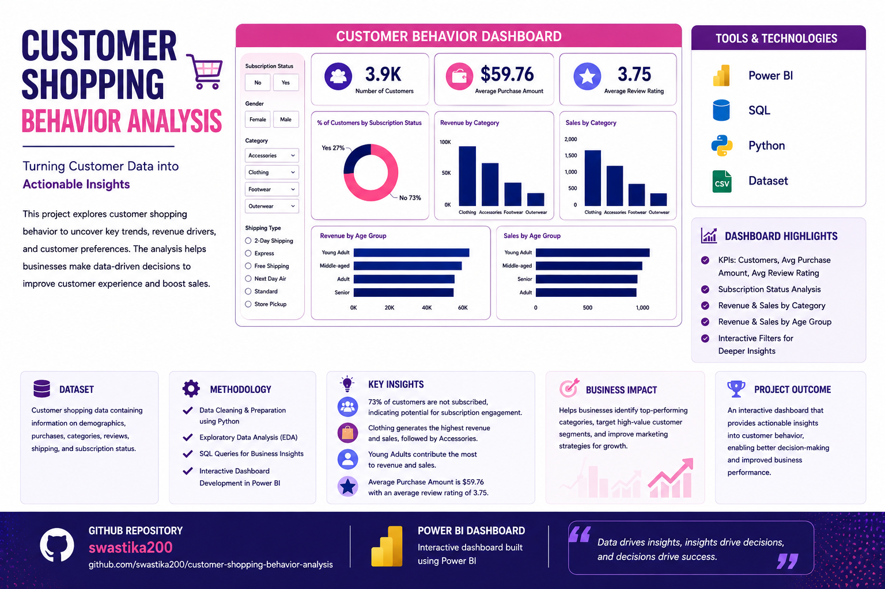

👨🏻‍💻Customer Behavior Data Analyst Portfolio Project
This project represents a complete, industry standard, end-to-end data analytics workflow, designed to mirror the real responsibilities of professional analysts in modern business environments. The project encompasses all critical stages of data analysis, from data preparation and modeling to insight generation, visualization, and reporting.

## Business Problem Statement

A leading retail company wants to better understand its customers’ shopping behavior in order
to improve sales, customer satisfaction, and long-term loyalty. The management team has
noticed changes in purchasing patterns across demographics, product categories, and sales
channels (online vs. offline). They are particularly interested in uncovering which factors, such
as discounts, reviews, seasons, or payment preferences, drive consumer decisions and repeat
purchases.
You are tasked with analyzing the company’s consumer behavior dataset to answer the
following overarching business question:
“How can the company leverage consumer shopping data to identify trends, improve
customer engagement, and optimize marketing and product strategies?”

## Project Poster

📌 Project Overview

The goal of this project is to simulate a corporate-grade end-to-end data analytics workflow, demonstrating the ability to translate raw data into strategic business intelligence by:

✅ Data Preparation,Modeling & Exploratory Data Analysis (Python): Clean and transform the raw dataset for analysis.

✅ Data Analysis (SQL): Simulate business transactions, and run queries to extract insights on customer segments, loyalty, and purchase drivers.

✅ Visualization & Insights (Power BI): Build an interactive dashboard that highlights key patterns and trends, enabling stakeholders to make data-driven decisions.

✅ Report and Presentation: Write a clear project report summarizing your key findings and business recommendations. Prepare a presentation that visually communicates insights and actionable recommendations to stakeholders.

## Dashboard View

(Dashboard.png)

## Key Highlights

Performed data analysis using SQL queries and Python.
Conducted data cleaning and transformation for accurate reporting.
Built an interactive Power BI dashboard to visualize customer trends.
Analyzed customer segmentation, purchasing patterns, and sales performance.
Generated business insights to help understand customer behavior and improve strategic decisions.

## Tools & Technologies
SQL
Python
Power BI
CSV Dataset

💡 Thanks for checking out the project!🚀
