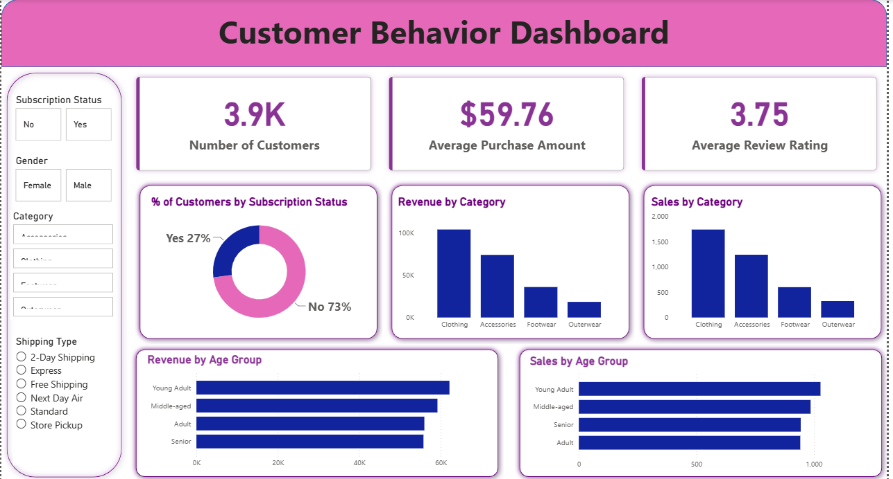

# 🛍️ Customer Shopping Behaviour Analysis

### Transforming Customer Data into Actionable Business Insights

Customer Shopping Behaviour Analysis is an end-to-end Data Analytics project that simulates how modern businesses leverage customer data to drive strategic decisions. By combining SQL, Python, and Power BI, this project uncovers valuable insights into customer purchasing patterns, revenue trends, product performance, and shopping preferences.

The project follows an industry-standard analytics workflow—from data preparation and exploratory analysis to interactive dashboard development and business intelligence reporting.

Whether you're a business stakeholder looking to improve customer engagement or a data enthusiast exploring real-world analytics, this project demonstrates how data can be transformed into meaningful and actionable insights.

## Project Poster

📌 Project Overview

The goal of this project is to simulate a corporate-grade end-to-end data analytics workflow, demonstrating the ability to translate raw data into strategic business intelligence by:

✅ Data Preparation,Modeling & Exploratory Data Analysis (Python): Clean and transform the raw dataset for analysis.

✅ Data Analysis (SQL): Simulate business transactions, and run queries to extract insights on customer segments, loyalty, and purchase drivers.

✅ Visualization & Insights (Power BI): Build an interactive dashboard that highlights key patterns and trends, enabling stakeholders to make data-driven decisions.

✅ Report and Presentation: Write a clear project report summarizing your key findings and business recommendations. Prepare a presentation that visually communicates insights and actionable recommendations to stakeholders.

## Dashboard Preview

## Key Highlights

Performed data analysis using SQL queries and Python.
Conducted data cleaning and transformation for accurate reporting.
Built an interactive Power BI dashboard to visualize customer trends.
Analyzed customer segmentation, purchasing patterns, and sales performance.
Generated business insights to help understand customer behavior and improve strategic decisions.

## Tools & Technologies
SQL

Python

Power BI

CSV Dataset

💡 Thanks for checking out the project!🚀
